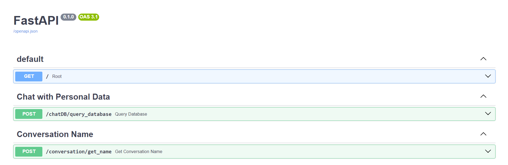
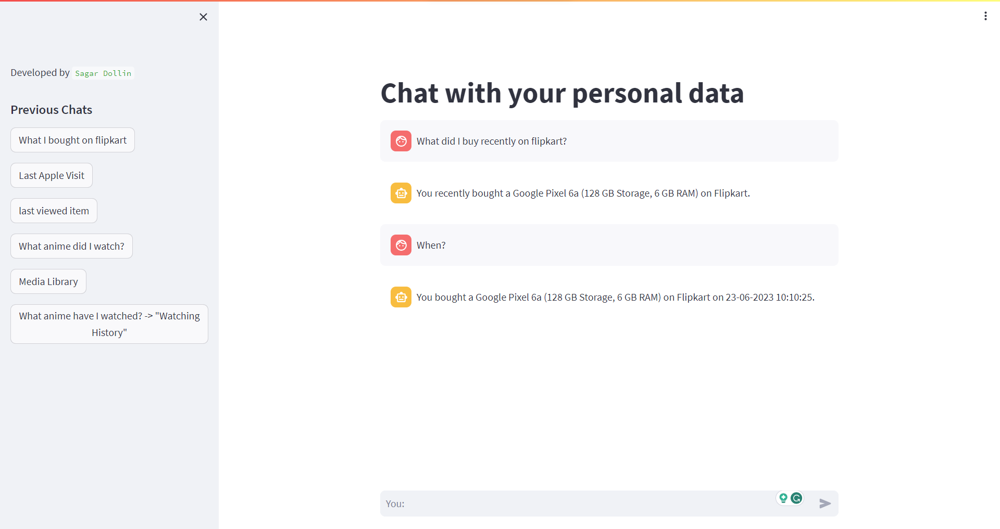

# ChatBot Server & Frontend Application

This repository contains a ChatBot server developed using FastAPI that interacts with a PostgreSQL database to process user queries. There's also a frontend application designed using Streamlit that serves as an example UI for the ChatBot server.

## Prerequisites:

- Python 3.x
- PostgreSQL (installed and running on localhost:5432 by default)
- A `.env` file with required environment variables. You can generate one using `create_env_file.py`.

## Setting Up PostgreSQL Database:

Before you proceed with the backend and frontend setup, make sure you have a PostgreSQL database ready to use. If not, here's a brief guide to creating a new database and table.

1. Open a PostgreSQL terminal or use a GUI like pgAdmin.
2. Run the following SQL command to create a new database:
   ```sql
   CREATE DATABASE YOUR_DB_NAME;
   ```


## Setting Up Backend:

### Step 1: Clone the Repository
```bash
git clone https://github.com/SagarDollin/chatbot-personalData.git
cd chatbot-personalData
```

### Step 2: Create a Virtual Environment (Optional but Recommended)
```bash
python -m venv venv
source venv/bin/activate   # On Windows, use 'venv\Scripts\activate'
```

### Step 3: Install the Required Dependencies
```bash
pip install -r requirements.txt
```

### Step 4: Create the .env File

Use the provided script to create a `.env` file with necessary configurations:

```bash
python create_env_file.py --api_key YOUR_OPENAI_API_KEY --db_pass YOUR_DB_PASSWORD --database YOUR_DB_NAME
```

**Note:** Replace placeholders like `YOUR_OPENAI_API_KEY` with actual values.

### Step 5: Populate the Database

Download your chrome browserhistory.json file and save it in the Chrome folder at the root level.

Run `db.py` to populate the PostgreSQL database with a table called `browserhistory`.

```bash
python db.py
```

### Step 6: Start the Backend Server
```bash
python server.py
```
You should see a message: `OpenAPI key has been set, the server has been started!`

Your backend server is now running on http://127.0.0.1:8001/.

You can view and send requests to the all the microservices on: http://127.0.0.1:8001/docs#

### Backend


## Using Postman with Backend:

### 1. Get Root:
Send a GET request to `http://127.0.0.1:8001/` to get the server status.

### 2. Chat Query:
To chat with the bot, send a POST request to `http://127.0.0.1:8001/chatDB/query_database` with the following body:

```json
{
  "prompt": "YOUR_PROMPT_HERE",
  "chat_history": "YOUR_CHAT_HISTORY_HERE"
}
```

Replace `YOUR_PROMPT_HERE` and `YOUR_CHAT_HISTORY_HERE` with your desired values.

### 3. Get Conversation Name:
To get a name for a conversation based on a user query, send a POST request to `http://127.0.0.1:8001/conversation/get_name` with the body containing your query as a string.

## Running Frontend Application:

After setting up and running the backend server, you can run the Streamlit frontend as an example UI.

### Step 1: Start the Frontend Application:

```bash
cd frontend
streamlit run frontendApp.py
```
### Frontend


You'll see a new browser window/tab opening with the ChatBot UI. Here, you can input messages and interact with the ChatBot, view previous chats, and more.

## Conclusion:

This README provides steps to set up both the backend server and frontend application. Make sure the backend server is running when you're interacting with the frontend application. The server handles chat queries and also suggests conversation names based on user queries. The frontend serves as an example of how you can integrate and interact with the backend.

Developed by Sagar Dollin.